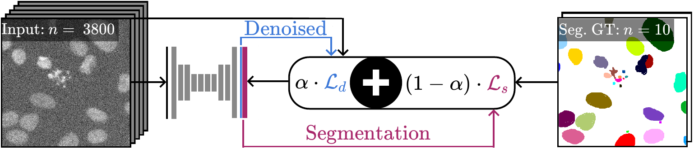

# DenoiSeg: Joint Denoising and Segmentation
Tim-Oliver Buchholz<sup>\*,1,2</sup>, Mangal Prakash<sup>\*,1,2,</sup>, Alexander Krull<sup>1,2,3</sup>,
and Florian Jug<sup>1,2,^</sup>

<sup>1</sup> Max Planck Institute of Molecular Cell Biology and Genetics, Dresden, Germany <br />
<sup>2</sup> Center for Systems Biology, Dresden, Germany <br />
<sup>3</sup> Max Planck Institute for Physics of Complex Systems, Dresden, Germany <br />
<sup>^</sup> <code>jug@mpi-cbg.de</code> <br />
<sup>*</sup> Equal contribution (alphabetical order).

Microscopy image analysis often requires the segmentation of objects, 
but training data for this task is typically scarce and hard to obtain.
Here we propose DenoiSeg, a new method that can be trained end-to-end 
on only a few annotated ground truth segmentations. 
We achieve this by extending [Noise2Void](https://github.com/juglab/n2v), 
a self-supervised denoising scheme that can be trained on noisy images alone, 
to also predict dense 3-class segmentations. The reason for the success 
of our method is that segmentation can profit from denoising, especially 
when performed jointly within the same network. The network becomes a 
denoising expert by seeing all available raw data, while  co-learning to 
segment, even if only a few segmentation labels are available. This 
hypothesis is additionally fueled by our observation that the best 
segmentation results on high quality (very low noise) raw data are obtained 
when moderate amounts of synthetic noise are added. This renders the 
denoising-task non-trivial and unleashes the desired co-learning effect.
We believe that DenoiSeg offers a viable way to circumvent the tremendous 
hunger for high quality training data and effectively enables few-shot learning 
of dense segmentations.

Paper: [https://arxiv.org/abs/2005.02987](https://arxiv.org/abs/2005.02987)

## Installation
This implementation requires [Tensorflow](https://www.tensorflow.org/install/).
We have tested DenoiSeg on LinuxMint 19  using python 3.6 and 3.7 and tensorflow-gpu 1.15.

#### If you start from scratch...
We recommend using [miniconda](https://docs.conda.io/en/latest/miniconda.html).
If you do not yet have a strong opinion, just use it too!

After installing Miniconda, the following lines might are likely the easiest way to get Tensorflow and CuDNN installed on your machine (_Note:_ Macs are not supported, and if you sit on a Windows machine all this might also require some modifications.):

```
$ conda create -n 'denoiSeg' python=3.7
$ source activate denoiSeg
$ conda install -c conda-forge tensorflow-gpu=1.15 keras=2.2.5
$ pip install jupyter
$ conda install nb_conda
```

Note: it is very important that the version of keras be 2.2.4 or 2.2.5, hence the explicit installation above.
Once this is done (or you had tensorflow et al. installed already), you can install DenoiSeg with one of the following two options:

#### Option 1: PIP (current stable release) 
```
$ pip install denoiseg
```

#### Option 2: Git-Clone and install from sources (current master-branch version)
This option is ideal if you want to edit the code. Clone the repository:

```
$ git clone https://github.com/juglab/DenoiSeg.git
```
Change into its directory and install it:

```
$ cd DenoiSeg
$ pip install -e .
```
You are now ready to run DenoiSeg.

## How to use it?
Have a look at our jupyter notebook:
* [Example: DSB2018](https://github.com/juglab/DenoiSeg/tree/master/examples/DenoiSeg_2D/DSB2018_DenoiSeg_Example.ipynb)
* [Example: Fly Wing](https://github.com/juglab/DenoiSeg/tree/master/examples/DenoiSeg_2D/FlyWing_DenoiSeg_Example.ipynb)
* [Example: Mouse Nuclei](https://github.com/juglab/DenoiSeg/tree/master/examples/DenoiSeg_2D/MouseNuclei_DenoiSeg_Example.ipynb)

## How to cite:
```
@inproceedings{BuchholzPrakash2020DenoiSeg,
  title={DenoiSeg: Joint Denoising and Segmentation},
  author={Tim-Oliver Buchholz and Mangal Prakash and Alexander Krull and Florian Jug},
  year={2020}
}
```

## Reproducibility
The current release and master is a refactored version of the code used for the paper. 
This refactored version produces the same number as reported in the paper, but if you
wish to use the exact code used in the paper, please continue [here](scripts/reproducibility/README.md).

Further results (qualitative and quantitative) can be found on the [wiki](https://github.com/juglab/DenoiSeg/wiki).
